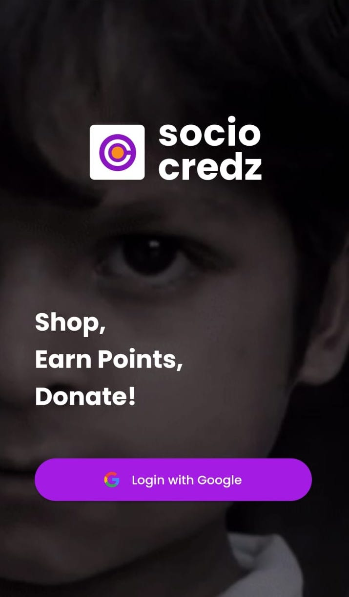
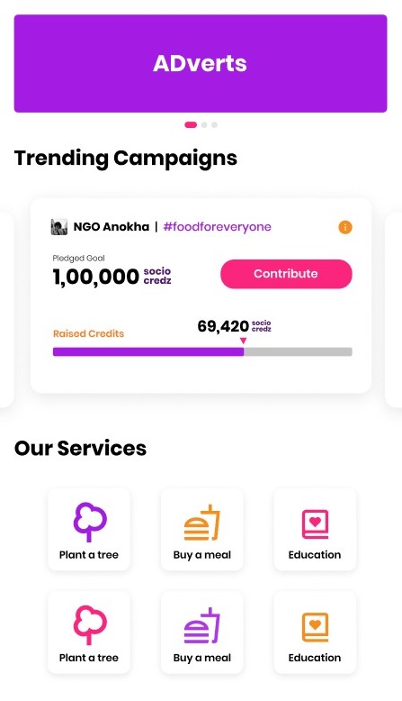
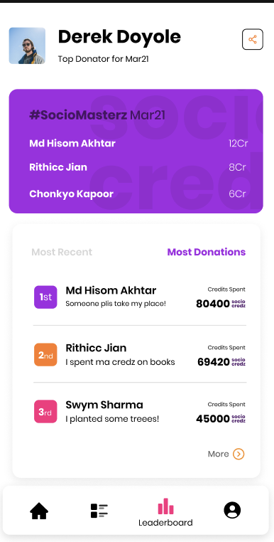
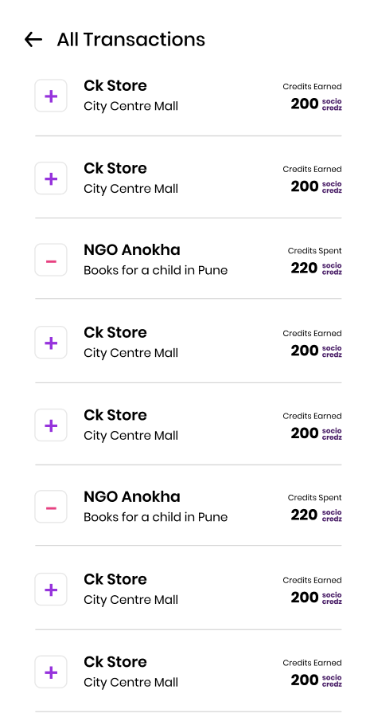
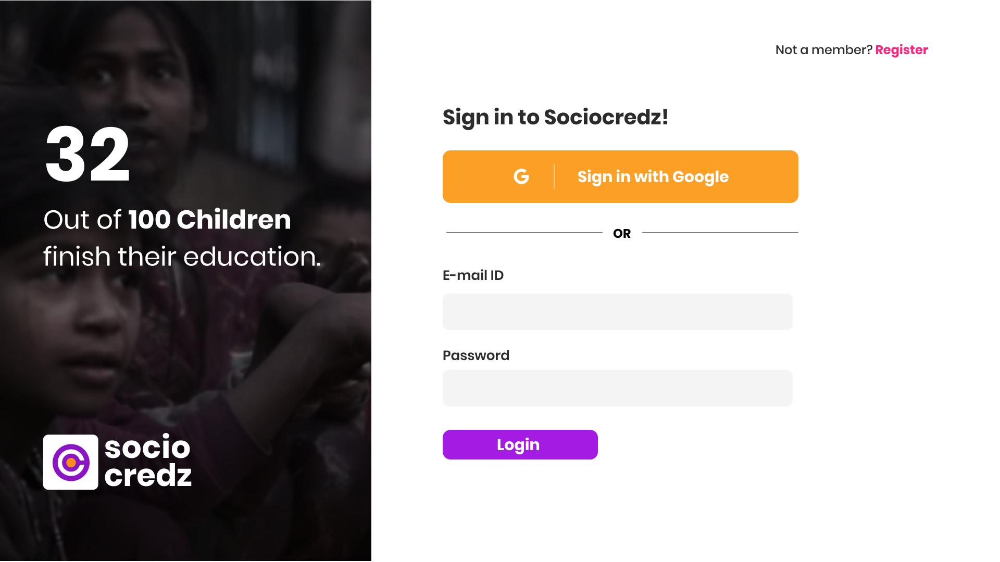

	
    <h2 align="center">SocioCredz</h2>
    <h5 align = "center"> Have you ever wanted to do something for the social cause but lacked the time and the means to do it?  Don’t worry SocioCredz is here to help you. SocioCredz will help you to provide education, and food, etc  to the people in need without you even spending a single penny from your pocket!

### What is the idea?
We often go to stores in the mall and after purchasing things, most of the time we link our   mobile
number with the company, and according to the shopping amount certain points are  added to our number which can be redeemed whenever a user wants. 

We aim to tie up with these companies so that instead of adding these points to the user’s  company account, the user can choose to add these points to our app ‘SocioCredz’. Now, what  can the users do with these credits? 

We offer various services such as distributing food, providing books, and proper sanitation to  the needy. Suppose distributing food costs 100 credits, the user can use his/her available  credits to select this service.

Now you might wonder how will the food, books, etc actually be distributed to the people in   need. We aim to tie up with NGOs for this purpose. We have made a frontend portal for the  NGOs to register themselves with us. The services selected by the user will be directed to the  NGOs that have the least number of requests so that there is no delay of service to the  people in need.  The NGOs can even start a campaign on our app to raise funds.

Lastly, how can the user trust us that service is delivered to those in need? Once the service is  completed by a representative of the NGO, he/she will upload a video on the portal which will  be visible to the user on the application as well.

### Links to the repositories
<ul>
<li><h5><a href="https://github.com/TeamRekursion/sociocredz-frontend">Frontend Repository</a></h5>
<li><h5><a href="https://github.com/TeamRekursion/sociocredz-backend">Backend Repository</a></h5>
<li><h5><a href="https://github.com/TeamRekursion/sociocredz-app"> Client-Side App Repository</a></h5>
<li><h5><a href="https://github.com/TeamRekursion/sociocredz-admin-app">Admin-Side App Repository</a></h5>
</ul>

### Designs Link
<ul>
<li> <h5><a href="https://www.figma.com/file/PqsI2E8BCmN7eWNX12j0ca/SocioCredz?node-id=16%3A130"> Figma Link
</ul>

### Tech Stack Used:
 
 
 
 
  
 

### Designs

## Team Members
- Nirmit Jatana
- Md Hishaam Akhtar
- Rithik Jain
- Mayank Kumar
- Chanakya Vivek Kapoor

	Made with :heart: by Team Rekursion</a>

